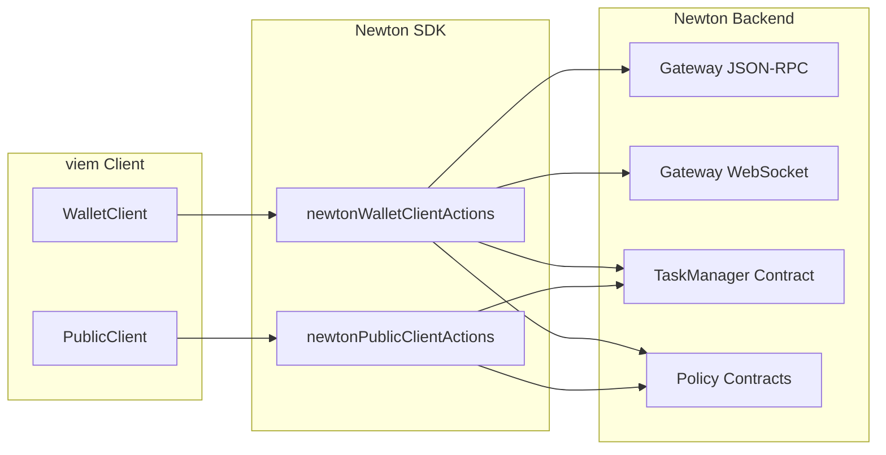
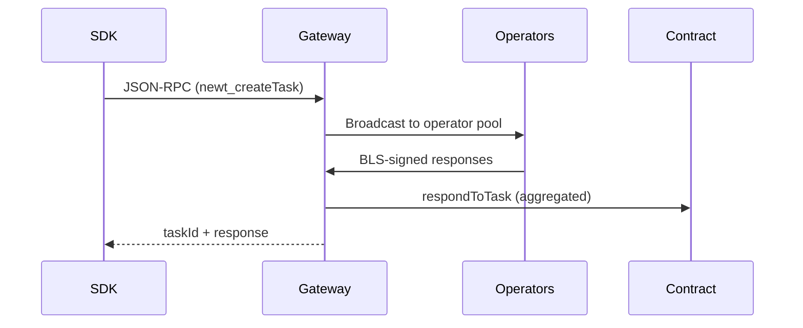

# Architecture Guidelines

## SDK Design Philosophy

Newton SDK is a **thin client library** — it wraps viem contract interactions and Newton Gateway JSON-RPC calls into a clean, type-safe API. The SDK should:

- Add no unnecessary abstraction layers
- Stay close to viem's patterns and conventions
- Be tree-shakeable (consumers only pay for what they use)
- Work in browsers, Node.js, and edge runtimes

## Client Extension Pattern

The SDK uses viem's `extend()` pattern to add Newton-specific actions to standard viem clients.



### Action Factories

Each action factory returns a function that takes a viem client and returns an object of methods:

```typescript
export function newtonPublicClientActions() {
  return (client: PublicClient) => ({
    // Read-only operations
    waitForTaskResponded: (params) => waitForTaskResponded(client, params),
    getTaskStatus: (params) => getTaskStatus(client, params),
    // Policy reads
    getPolicyId: (params) => getPolicyId(client, params),
    getPolicyCid: (params) => getPolicyCid(client, params),
    // Utility
    precomputePolicyId: (params) => precomputePolicyId(client, params),
  })
}
```

### Chain Validation

Both action factories validate `client.chain.id` against `SUPPORTED_CHAINS` at extension time, failing fast for unsupported chains.

## Module Boundaries

### `modules/avs/`

Core AVS interaction — task submission, evaluation, simulation. This is the primary module.

Key functions:
- `submitEvaluationRequest` — creates a task via Gateway RPC, returns `PendingTaskBuilder`
- `evaluateIntentDirect` — direct evaluation without on-chain confirmation
- `submitIntentAndSubscribe` — WebSocket-based task subscription
- `waitForTaskResponded` — polls contract events + WebSocket for task response
- `simulateTask/Policy/PolicyData` — simulation helpers

### `modules/policy/`

Policy contract wrappers — thin viem `readContract`/`writeContract` calls.

Read: `getPolicyId`, `getPolicyConfig`, `owner`, `factory`, `getPolicyCid`
Write: `initialize`, `renounceOwnership`, `transferOwnership`
Utility: `precomputePolicyId` (replicates Solidity `setPolicy` keccak256 client-side)

### `utils/`

Shared utilities. Each file is standalone — no cross-dependencies between utils.

- `https.ts` — `AvsHttpService` (JSON-RPC 2.0 over HTTP with `Authorization: Bearer`)
- `intent.ts` — Intent normalization and hex conversion for gateway
- `task-events.ts` — WebSocket subscription to task topics
- `cache-request.ts` — `fetchWithCache` (localStorage, configurable stale time)
- `promise-tools.ts` — `PromiEvent` (Promise + EventEmitter hybrid)
- `events.ts` — Strongly-typed EventEmitter

### `types/`

Type definitions only — no runtime code. Two entry points:
- `task.ts` — Intent, Task, TaskResponse, simulation types
- `policy.ts` — Policy types, config, set/get params

### `abis/`

Auto-generated contract ABIs. Never edit directly.

### `service/`

Browser-specific services (popup management for Newton Wallet).

## Gateway Communication

### HTTP (AvsHttpService)



- Base URL resolved from `GATEWAY_API_URLS[chainId]`
- `Authorization: Bearer` header for authentication
- Standard JSON-RPC 2.0 envelope (`{jsonrpc, method, params, id}`)

### WebSocket (Task Events)

- Connects to gateway WebSocket endpoint
- API key passed as query parameter
- Subscribes to task-specific topics for real-time updates
- Used by `submitIntentAndSubscribe` and `waitForTaskResponded`

## Contract Addresses

All contract addresses live in `src/const.ts`, keyed by chain ID:

- `TASK_MANAGER_ADDRESSES` — Newton Prover TaskManager per chain
- `ATTESTATION_VALIDATOR_ADDRESSES` — AttestationValidator per chain
- `GATEWAY_API_URLS` — Gateway HTTP endpoints per chain

These can be overridden per-call via `SdkOverrides`.

## ABI Sync from newton-prover-avs

ABIs in `src/abis/` are synced from the `newton-prover-avs` repository:

- Source: `newton-prover-avs/contracts/out/` (Foundry build artifacts)
- Deployment addresses: `newton-prover-avs/contracts/script/deployments/`
- Sync trigger: `pnpm sync-abis` (TODO: implement script)
- ABIs should track the `main` branch of newton-prover-avs

When contract interfaces change upstream, the ABI files must be re-synced before the SDK can use the new functions.

## Privacy Module (Planned)

The privacy module will add client-side HPKE encryption:

```
src/modules/privacy/
├── index.ts          # Public API: encryptPrivacyData, uploadEncryptedData, authorizePrivacyData
├── hpke.ts           # HPKE encrypt/decrypt (X25519 + ChaCha20-Poly1305)
├── envelope.ts       # SecureEnvelope construction with AAD binding
├── auth.ts           # Ed25519 authorization signatures (user + app dual-sig)
└── keys.ts           # Key derivation helpers
```

Design constraints:
- **Zero server round-trips** during encryption — gateway public key fetched once and cached
- **Offline capable** — all crypto operations run locally
- **Bundle < 50KB** — minimal WASM or pure JS crypto
- **AAD binding** — ciphertext bound to `keccak256(policyClient, chainId)` to prevent cross-context replay

## Design Principles

### Thin Wrappers

The SDK should be a thin layer over viem + gateway RPC. Avoid:
- Custom transport layers (use viem's)
- State management (leave to the consumer)
- Caching strategies beyond simple fetch cache
- Retry/circuit breaker logic (leave to the gateway)

### Type Safety End-to-End

Leverage viem's ABI type inference:

```typescript
// viem infers return types from ABI definitions
const result = await client.readContract({
  address: policyAddress,
  abi: newtonPolicyAbi,
  functionName: 'getPolicyCid',
})
// result is correctly typed as string
```

### Composability

Each function should work independently — consumers can import just what they need:

```typescript
// Consumer only pays for what they import
import { submitEvaluationRequest } from '@magicnewton/newton-protocol-sdk'
```

### Error Boundaries

SDK errors should be catchable and inspectable:

```typescript
try {
  await client.submitEvaluationRequest(params)
} catch (error) {
  if (error instanceof SDKError) {
    console.error(error.code, error.message)
  }
}
```
